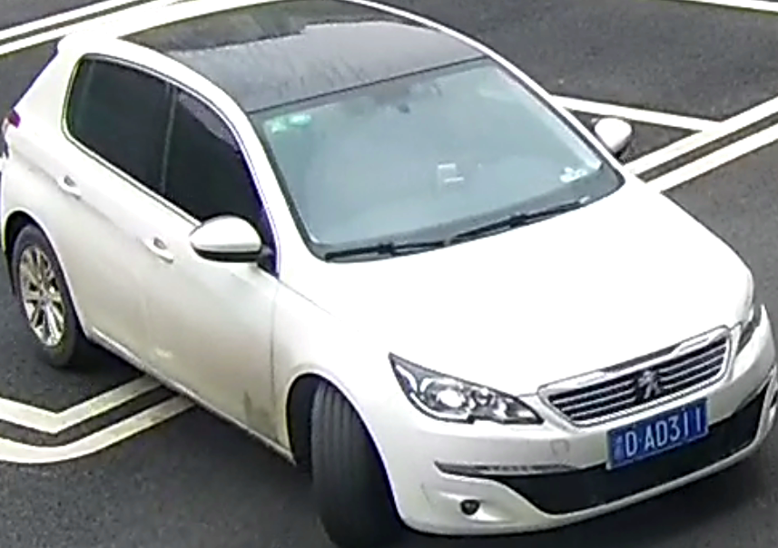

# Custom gst-nvinfer (DEMO)
This is a custom gst-nvinfer plugin to do some preprocess.

## Requirements
+ Deepstream 6.0+
+ Opencv

## Notice
This demo supports models:
+ [Retinaface](https://github.com/wang-xinyu/tensorrtx/tree/master/retinaface)
+ [Retina_License_Plate](https://github.com/gm19900510/Pytorch_Retina_License_Plate)

If want to use other models, codes in `tensor_extractor.cpp` should be modified for extracting landmarks from original tensor-output and `align_funcitons`.

## Usage
1. set cuda environment

```
export CUDA_VER=11.6
```
2. compile Makefile

```
make
make install
```
NOTE: To compile the sources, run make with "sudo" or root permission.

3. set config file

first to set primary gie's output-tensor-meta to true. For example, in retinaface config file:
```
output-tensor-meta=1
```

use kyewords
+ alignment-type: 1 for face, 2 for license plate
+ alignment-parent: indicates whether user-meta data stored in frame-meta or in object-meta
+ alignment-pics: save pictures or not
+ alignment-debug-level: spdlog debug level
  + 0:None
  + 1:info
  + 2:debug
  + 3:trace


Example
```
alignment-type=2
alignment-parent=2
alignment-pics=1
alignment-debug-level=3
```


## Comparison
License Plate

Saved input NvBufSurface


## TODO
use npp for alignment